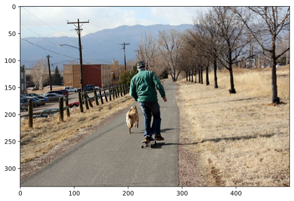
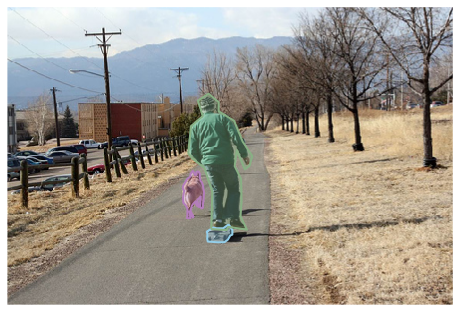
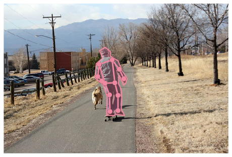
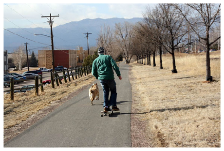
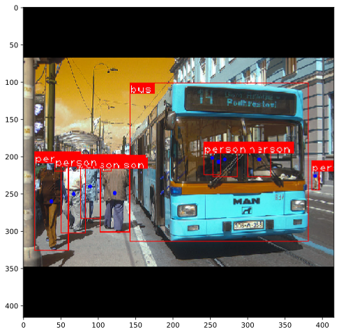
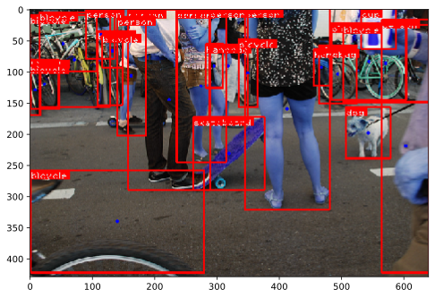
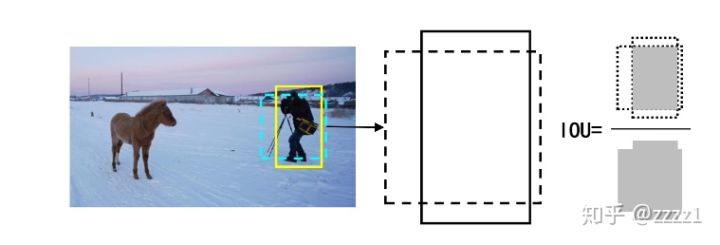
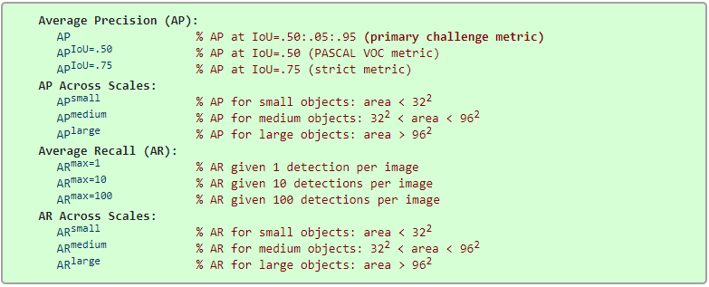

# 学习如何使用 MS COCO 数据集   
微软发布的 MS COCO 数据集是一个大型图像数据集, 专为目标检测、人体关键点检测、语义分割和字幕生成而设计。本文尝试学习python如何使用该数据集（主要关注目标检测）。

## COCO 数据格式
coco 数据集的标注数据采用json格式存储，基本结构如下：


```python
{
    "info": info,
    "images": [image], #这是一个image的列表，如[image1,image2,....]，
    "annotations": [annotation], #同理
    "licenses": [license], #同理
    "categories": [category]
}

info{
    "year": int, 
    "version": str, 
    "description": str, 
    "contributor": str, 
    "url": str, 
    "date_created": datetime,
}

image{
    "id": int, 
    "width": int, 
    "height": int, 
    "file_name": str, 
    "license": int, 
    "flickr_url": str, 
    "coco_url": str, 
    "date_captured": datetime,
}

license{
    "id": int, 
    "name": str, 
    "url": str,
}


# 目标检测的annotation
annotation{
    "id": int, 
    "image_id": int, 
    "category_id": int, 
    "segmentation": RLE or [polygon], 
    "area": float, 
    "bbox": [x,y,width,height], 
    "iscrowd": 0 or 1,
}

categories[{
    "id": int, 
    "name": str, 
    "supercategory": str,
}]
```

## COCO API

#### 安装coco api
COCO数据集提供了用于加载、解析和可视化的API，本文主要探索python api


```python
git clone https://github.com/cocodataset/cocoapi.git   # git、cd等shell命令在jupyter notebook中运行需要在前面加！
cd cocoapi/PythonAPI
make -j4 install # 这里使用install参数指示将pycocotools安装到conda虚拟环境中的site-packages 
cd ..

```

#### 数据集准备
1. 下载图像数据集（train2017.zip,val2017.zip,test2017.zip）并解压到cocoapi/images文件夹下
2. 下载标签数据集（）并解压到cocoapi/annotations文件夹下


```python
#下载图像数据

mkdir images
cd images

wget -c http://images.cocodataset.org/zips/train2017.zip  # --continue, 断点续传
wget -c http://images.cocodataset.org/zips/val2017.zip
wget -c http://images.cocodataset.org/zips/test2017.zip

unzip train2017.zip  
unzip val2017.zip
unzip test2017.zip

#下载标签数据

cd ..
makdir annotations
cd annotations

wget -c http://images.cocodataset.org/annotations/annotations_trainval2017.zip

unzip annotations_trainval2017.zip

cd ../../
```

#### 加载必要的依赖包


```python
%matplotlib inline 
from pycocotools.coco import COCO  
import numpy as np 
import skimage.io as io 
import matplotlib.pyplot as plt 
import pylab # matplotlib的一个模块，用于二维、三维图像绘制
pylab.rcParams['figure.figsize'] = (8.0,10.0) # 设置画布大小

```

#### 指定文件路径


```python
dataDir = './cocoapi/'
dataType = 'val2017' # 以验证集为例
annFile = '{}/annotations/instances_{}.json'.format(dataDir,dataType)
print(annFile)
```

    ./cocoapi//annotations/instances_val2017.json


#### 初始化COCO类(目标检测)


```python
coco = COCO(annFile)
```

    loading annotations into memory...
    Done (t=2.31s)
    creating index...
    index created!


#### 打印COCO数据类别及其父类


```python
catIds = coco.getCatIds()
#print("The total number of categories: \n",len(catIds))
#print("Categories Ids: \n",catIds)

cats = coco.loadCats(coco.getCatIds()) # [{'supercategory': 'person', 'id': 1, 'name': 'person'},...]
#print("Categories Names: \n",cats)

nms = [cat['name'] for cat in cats]
print("COCO categories: \n",nms)

sup_nms = set([cat['supercategory'] for cat in cats]) # 使用set()是为了去除重复项
print("COCO supercategories: \n",sup_nms)
```

    COCO categories: 
     ['person', 'bicycle', 'car', 'motorcycle', 'airplane', 'bus', 'train', 'truck', 'boat', 'traffic light', 'fire hydrant', 'stop sign', 'parking meter', 'bench', 'bird', 'cat', 'dog', 'horse', 'sheep', 'cow', 'elephant', 'bear', 'zebra', 'giraffe', 'backpack', 'umbrella', 'handbag', 'tie', 'suitcase', 'frisbee', 'skis', 'snowboard', 'sports ball', 'kite', 'baseball bat', 'baseball glove', 'skateboard', 'surfboard', 'tennis racket', 'bottle', 'wine glass', 'cup', 'fork', 'knife', 'spoon', 'bowl', 'banana', 'apple', 'sandwich', 'orange', 'broccoli', 'carrot', 'hot dog', 'pizza', 'donut', 'cake', 'chair', 'couch', 'potted plant', 'bed', 'dining table', 'toilet', 'tv', 'laptop', 'mouse', 'remote', 'keyboard', 'cell phone', 'microwave', 'oven', 'toaster', 'sink', 'refrigerator', 'book', 'clock', 'vase', 'scissors', 'teddy bear', 'hair drier', 'toothbrush']
    COCO supercategories: 
     {'appliance', 'sports', 'animal', 'outdoor', 'indoor', 'accessory', 'food', 'person', 'kitchen', 'furniture', 'vehicle', 'electronic'}


#### 获取指定图像


```python
#获取"同时包含"指定类别的图像
catIds = coco.getCatIds(catNms=['person','dog','skateboard'])
print("Number of categories: {}, Category_id: {}\n".format(len(catIds),catIds))
imgIds = coco.getImgIds(catIds=catIds)
print("Number of images: {}, Imges ids: {}\n".format(len(imgIds),imgIds))
imgs = coco.loadImgs(imgIds)
#print(imgs)
#[{'license': 2, 'file_name': '000000549220.jpg', 'coco_url': 'http://images.cocodataset.org/val2017/000000549220.jpg', 'height': 640, 'width': 480, 'date_captured': '2013-11-18 11:01:23', 'flickr_url': 'http://farm4.staticflickr.com/3145/2419498650_fdfe34eb93_z.jpg', 'id': 549220},...]

#获取指定ids的图像
imgId=[324158]
img = coco.loadImgs(imgId)[0] #loadImgs返回的是包含图像dict的list，索引[0]直接选取到dict
#print(img)

#从imgIds中随机选取一张图片
img = coco.loadImgs(imgIds[np.random.randint(0,len(imgIds))])[0]
#print(img)
```

    Number of categories: 3, Category_id: [1, 18, 41]
    
    Number of images: 3, Imges ids: [549220, 324158, 279278]
    


#### 加载和显示图像


```python
#img = {'license': 1, 'file_name': '000000324158.jpg', 'coco_url': 'http://images.cocodataset.org/val2017/000000324158.jpg', 'height': 334, 'width': 500, 'date_captured': '2013-11-19 23:54:06', 'flickr_url': 'http://farm1.staticflickr.com/169/417836491_5bf8762150_z.jpg', 'id': 324158}

#使用文件名加载图像
I = io.imread('%s/images/%s/%s'%(dataDir,dataType,img['file_name']))
#使用url加载图像
#I = io.imread(img['coco_url']) # 这应该是到网络上加载图像

#plt.axis('off') #不显示坐标尺寸
plt.imshow(I)
plt.show
```


    <function matplotlib.pyplot.show(*args, **kw)>





#### 加载和显示实例标签


```python
plt.imshow(I); plt.axis('off')
annIds = coco.getAnnIds(imgIds=img['id'],catIds=catIds,iscrowd=None) #catIds用于显示指定类别的标签
anns = coco.loadAnns(annIds)
coco.showAnns(anns)
```





### 人体关键点

#### 初始化coco api


```python
annFile = '{}/annotations/person_keypoints_{}.json'.format(dataDir,dataType)
coco_kps = COCO(annFile)
```

    loading annotations into memory...
    Done (t=0.62s)
    creating index...
    index created!


#### 加载和显示关键点标签


```python
plt.imshow(I); plt.axis('off')
ax = plt.gca() #跟画子图有关
annIds = coco_kps.getAnnIds(imgIds=img['id'],catIds=catIds,iscrowd=None)
anns = coco_kps.loadAnns(annIds)
coco_kps.showAnns(anns)
```





### 图像字幕

#### 初始化coco api


```python
annFile = '{}/annotations/captions_{}.json'.format(dataDir,dataType)
coco_caps=COCO(annFile)
```

    loading annotations into memory...
    Done (t=0.17s)
    creating index...
    index created!


#### 加载和显示caption标签


```python
annIds = coco_caps.getAnnIds(imgIds=img['id']);
anns = coco_caps.loadAnns(annIds)
coco_caps.showAnns(anns)
plt.imshow(I); plt.axis('off'); plt.show()
```

    A man is skate boarding down a path and a dog is running by his side.
    A man on a skateboard with a dog outside. 
    A person riding a skate board with a dog following beside.
    This man is riding a skateboard behind a dog.
    A man walking his dog on a quiet country road.





## 编写COCO数据集的Pytorch接口


```python
#coco数据集目标检测Pytorch接口
import os
import os.path
from PIL import Image
import numpy as np
import cv2
import torch
import torch.utils.data as data
import torchvision.transforms as transforms
import torch.nn.functional as F 
from pycocotools.coco import COCO 
import matplotlib.pyplot as plt


class CocoDetection(data.Dataset):
    """
    Args:
        root (string): Root directory where images are downloaded to.
        annFile (string): Path to json annotation file.
        
    """
    def __init__(self,root,annFile,img_size=416):
        super(CocoDetection,self).__init__()
        self.root = root 
        self.coco = COCO(annFile)
        self.ids = list(sorted(self.coco.imgs.keys()))

        self.img_size = img_size
     
        COCO_LABEL_MAP = { 1:  1,  2:  2,  3:  3,  4:  4,  5:  5,  6:  6,  7:  7,  8:  8,
                   9:  9, 10: 10, 11: 11, 13: 12, 14: 13, 15: 14, 16: 15, 17: 16,
                  18: 17, 19: 18, 20: 19, 21: 20, 22: 21, 23: 22, 24: 23, 25: 24,
                  27: 25, 28: 26, 31: 27, 32: 28, 33: 29, 34: 30, 35: 31, 36: 32,
                  37: 33, 38: 34, 39: 35, 40: 36, 41: 37, 42: 38, 43: 39, 44: 40,
                  46: 41, 47: 42, 48: 43, 49: 44, 50: 45, 51: 46, 52: 47, 53: 48,
                  54: 49, 55: 50, 56: 51, 57: 52, 58: 53, 59: 54, 60: 55, 61: 56,
                  62: 57, 63: 58, 64: 59, 65: 60, 67: 61, 70: 62, 72: 63, 73: 64,
                  74: 65, 75: 66, 76: 67, 77: 68, 78: 69, 79: 70, 80: 71, 81: 72,
                  82: 73, 84: 74, 85: 75, 86: 76, 87: 77, 88: 78, 89: 79, 90: 80}
        self.label_map = COCO_LABEL_MAP

        self.batch_count = 0

    def __getitem__(self,index):

        coco = self.coco
        img_id = self.ids[index]

        #==============
        # image
        # =============
        path = coco.loadImgs(img_id)[0]['file_name']
        img = Image.open(os.path.join(self.root,path)).convert('RGB')
        img = transforms.ToTensor()(img)

        # Pad to square resolution
        c, h, w = img.shape
    

        dim_diff = np.abs(h - w)
        pad1, pad2 = dim_diff // 2, dim_diff - dim_diff // 2
        # Determine padding（左，右，上，下）
        pad = (0, 0, pad1, pad2) if h <= w else (pad1, pad2, 0, 0)
        # Add padding
        img = F.pad(img, pad, "constant", value=0)
        _, padded_h, padded_w = img.shape

        # Resize
        img = F.interpolate(img.unsqueeze(0), size=self.img_size, mode="nearest").squeeze(0)

        #==============
        # labels
        # =============
        annids = coco.getAnnIds(imgIds=img_id)
        anns = coco.loadAnns(annids)

        bboxes = []
        for i in range(len(anns)):
            bbox = [self.label_map[anns[i]['category_id']]-1]
            bbox.extend(anns[i]['bbox']) # (x,y,w,h) x和y表示bbox左上角的坐标，w和h表示bbox的宽度和高度
            bboxes.append(bbox)
        
        bboxes = torch.from_numpy(np.array(bboxes))

        # Extract coordinates for unpadded + unscaled image（这好像计算出来的是bbox左上和右下两点的坐标）
        x1 = (bboxes[:, 1])
        y1 = (bboxes[:, 2])
        x2 = (bboxes[:, 1] + bboxes[:, 3])
        y2 = (bboxes[:, 2] + bboxes[:, 4])
        # Adjust for added padding（调整padding后两点的坐标）
        x1 += pad[0]
        y1 += pad[2]
        x2 += pad[1]
        y2 += pad[3]
        # Returns (x, y, w, h)（重新归一化，（x,y）表示中心点坐标，（w,h）表示bbox的宽和高）
        bboxes[:, 1] = ((x1 + x2) / 2) / padded_w
        bboxes[:, 2] = ((y1 + y2) / 2) / padded_h
        bboxes[:, 3] *= 1 / padded_w
        bboxes[:, 4] *= 1 / padded_h

        #bboxes的格式为(category,x,y,w,h)
        targets = torch.zeros((len(bboxes), 6))
        targets[:, 1:] = bboxes


        return img, targets
    
    def collate_fn(self, batch):
        """将数据和标签拼接成batch"""
        imgs, targets = list(zip(*batch))
        # Remove empty placeholder targets
        targets = [bboxes for bboxes in targets if bboxes is not None]
        # Add sample index to targets
        for i, bboxes in enumerate(targets):
            bboxes[:, 0] = i # 使用索引表示哪些bboxes对应batch中的那张图片 此时bboxes的格式为(index,category,x,y,w,h)
        targets = torch.cat(targets, 0) #拼接
    
        imgs = torch.stack([img for img in imgs])
        self.batch_count += 1
        return imgs, targets


    def __len__(self):
        return len(self.ids)
```

#### 使用Pytorch加载一张图片并显示检测框


```python
dataDir = './cocoapi/images/val2014'
annFile = './cocoapi/annotations/instances_val2014.json'

dataset = CocoDetection(root=dataDir,annFile=annFile)
# image, label = dataset[5]
# print (image.size())
# print (label)

dataset_loader = torch.utils.data.DataLoader(dataset=dataset,
                                           batch_size=1, 
                                           shuffle=True,
                                           collate_fn=dataset.collate_fn)

# When iteration starts, queue and thread start to load data from files.
data_iter = iter(dataset_loader)

# Mini-batch images and labels.
images, labels = data_iter.next() # labels: (index,category,x,y,w,h)
# print(images.shape)
# print(labels.shape)

b, c, h, w = images.shape
img = images.mul(255).byte()
img = img.cpu().numpy().squeeze(0).transpose((1, 2, 0))
img = cv2.cvtColor(img, cv2.COLOR_RGB2BGR)

COCO_REVERSE_LABEL_MAP = { 1:  1,  2:  2,  3:  3,  4:  4,  5:  5,  6:  6,  7:  7,  8:  8,
                   9:  9, 10: 10, 11: 11, 12: 13, 13: 14, 14: 15, 15: 16, 16: 17,
                  17: 18, 18: 19, 19: 20, 20: 21, 21: 22, 22: 23, 23: 24, 24: 25,
                  25: 27, 26: 28, 27: 31, 28: 32, 29: 33, 30: 34, 31: 35, 32: 36,
                  33: 37, 34: 38, 35: 39, 36: 40, 37: 41, 38: 42, 39: 43, 40: 44,
                  41: 46, 42: 47, 43: 48, 44: 49, 45: 50, 46: 51, 47: 52, 48: 53,
                  49: 54, 50: 55, 51: 56, 52: 57, 53: 58, 54: 59, 55: 60, 56: 61,
                  57: 62, 58: 63, 59: 64, 60: 65, 61: 67, 62: 70, 63: 72, 64: 73,
                  65: 74, 66: 75, 67: 76, 68: 77, 69: 78, 70: 79, 71: 80, 72: 81,
                  73: 82, 74: 84, 75: 85, 76: 86, 77: 87, 78: 88, 79: 89, 80: 90}

bboxes = labels.cpu().numpy().squeeze()
for i in range(len(bboxes)):
    x1 = int(w * (bboxes[i][2]-bboxes[i][4]/2))  
    y1 = int(h * (bboxes[i][3]-bboxes[i][5]/2))
    x2 = int(w * (bboxes[i][2]+bboxes[i][4]/2))  
    y2 = int(h * (bboxes[i][3]+bboxes[i][5]/2))

    cv2.rectangle(img, (x1,y1), (x2,y2), (255, 0, 0), thickness=1)
    cv2.circle(img, (int(w*bboxes[i][2]),int(h*bboxes[i][3])), 1, (0,0,255), thickness=2)
    
    catId = COCO_REVERSE_LABEL_MAP[int(bboxes[i][1])+1]
    cat = coco.loadCats(catId)
    label = cat[0]['name']
    # print(label)
    t_size = cv2.getTextSize(label, cv2.FONT_HERSHEY_PLAIN, 1 , 1)[0]
    x3, y3 = x1+t_size[0]+3, y1+t_size[1]+4
    cv2.rectangle(img, (x1,y1), (x3,y3), (255, 0, 0), thickness=-1)
    cv2.putText(img, label, (x1, y1 + t_size[1] + 4), cv2.FONT_HERSHEY_PLAIN, 1, [225,255,255], 1);

plt.imshow(img)

```

    loading annotations into memory...
    Done (t=27.27s)
    creating index...
    index created!


    <matplotlib.image.AxesImage at 0x7f62c3252dd8>





#### 直接使用coco api加载图像并显示检测框


```python
from pycocotools.coco import COCO
import cv2
import matplotlib.pyplot as plt
import numpy as np

dataDir = "./cocoapi/images/val2017"
annFile = "./cocoapi/annotations/instances_val2017.json" 
coco = COCO(annFile)
catIds = coco.getCatIds(catNms=['person','dog','skateboard'])
imgIds = coco.getImgIds(catIds=catIds )
imgId = imgIds[np.random.randint(0,len(imgIds))]
img = coco.loadImgs(imgId)[0]
annIds = coco.getAnnIds(imgIds=imgId,iscrowd=None)
anns = coco.loadAnns(annIds)


img = cv2.imread('%s/%s'%(dataDir,img['file_name']))
print(img.shape)
for i in range(len(anns)):
    bbox = anns[i]['bbox']
    x1 = int(bbox[0])  
    y1 = int(bbox[1])
    x2 = int((bbox[0] + bbox[2]))  
    y2 = int((bbox[1] + bbox[3]))
    cv2.rectangle(img, (x1,y1), (x2,y2), (255, 0, 0), thickness=2)
    cv2.circle(img, (int((x1+x2)/2),int((y1+y2)/2)), 1, (0,0,255), thickness=2)
    
    catId = anns[i]['category_id']
    cat = coco.loadCats(catId)
    label = cat[0]['name']
    t_size = cv2.getTextSize(label, cv2.FONT_HERSHEY_PLAIN, 1 , 1)[0]
    x3, y3 = x1+t_size[0]+3, y1+t_size[1]+4
    cv2.rectangle(img, (x1,y1), (x3,y3), (255, 0, 0), thickness=-1)
    cv2.putText(img, label, (x1, y1 + t_size[1] + 4), cv2.FONT_HERSHEY_PLAIN, 1, [225,255,255], 1);
plt.imshow(img)
# coco.showAnns(anns)
```

    loading annotations into memory...
    Done (t=5.02s)
    creating index...
    index created!
    (429, 640, 3)


    <matplotlib.image.AxesImage at 0x7f6366e4b8d0>





## COCO数据集目标检测评价指标

#### 检测结果格式
目标检测需要同时判断目标是否存在以及目标的位置，因此预测结果中必须包含“类别ID”以及bbox的坐标（一般用中心点坐标表示，也有可能用左上角坐标表示，COCO数据集用的是左上角坐标，本文将其转换成了中心点坐标）和大小（用宽度和高度表示）。同时，为了评估误判的风险，每一个预测框增加一个置信度分数（score）表示模型对该预测的信心。因此，预测结果具备以下结构：


```python
[{
    "image_id": int, 
    "category_id": int, 
    "bbox": [x,y,width,height], 
    "score": float,
}]
```

#### 什么是好的检测结果？
首先，一个好的检测结果必须能够正确预测目标的类别，类别错了一切白搭。
其次，检测的位置信息必须准确，也就是检测框必须尽可能地与目标贴合。“贴合度”往往采用IoU（交并比）来表示，交并比就是检测框与Ground Truth的重合面积（交集）与两者全部的面积（并集，不重复计算重合部分面积）的比值。




*图片来源见水印*

#### COCO数据集中的目标检测评价指标
在COCO数据集中，主要采用以下12种指标评价目标检测模型的性能。



*注：[0.50:0.05:0.95] 表示从0.50到0.95以0.05为间隔的序列 (0.5, 0.55, 0.6, ..., 0.9, 0.95)*

*AP (averaged across all 10 IoU thresholds and all 80 categories)*

#### Average Precision (AP)
首先，在目标检测任务中，有些使用场景对位置的准确度要求不高，有些则要求精确定位。位置信息精确度通过设置不同IoU阈值实现，COCO数据集设定的阈值为 (0.5, 0.55, 0.6, ..., 0.9, 0.95)。给定某个阈值，如果检测框与Ground-Truth的Iou超过该阈值则视为检测成功，这样就可以计算出该IoU下模型的性能。

其次，需要考虑类别均衡的稳定，有些使用场景不同类别的目标检测的重要性不同（误检的影响大小不同），因此需要公平地评价检测模型在各个类别上的性能。先给定一个IoU阈值，然后对所有的检测结果和Ground-Truth按类别分类，并对每一个类别计算出一个准确率（AP），最后对所有类比的准确率取平均值（mAP），这就是这个模型在该IoU下的性能。

COCO数据集的AP和AR还需要将多个IoU下的性能表现做平均。


#### 传统 mAP 计算过程
给定IoU阈值，计算mAP。

1 定义所有的检测结果为dts，Ground-Truth为gts，遍历目标类别，选取每一类别的检测结果和Ground-Truth（_dts,_gts）

2 在该类别下，遍历图片，选取每一图片的检测结果和Ground-Truth（_dts_,_gts_）。

3 对该图品的检测结果（_dts_）依据置信度分数（score）排序

4 依序遍历_dts_中所有的dt，计算dt与_gts_内所有Ground-Truth的IoU，如果最大的IoU大于阈值，视为检测成功，算作TP（True Positive），并且最大IoU对应的gt被视为匹配成功。如果该dt与所有gt的IOU都没超过阈值，自然就是FP（False Positive）

5 同时，每当一个gt被检测成功后，都会从_gts_和_gts中“被取走”，以免后续的检测结果重复匹配

6 如果有多个检测结果都与同一个gt匹配，那么分数最高的那个会被算为TP，其余均为FP。所以所有在_dts中但不在TPs中的dt都属于FP

7 由于被匹配过的gt都会“被取走”，因此_gts中剩下的就是没有被匹配上的FN（False Negative） 

8 precision = TP / (TP + FP), recall = TP / (TP + FN)

9 在每一个类别下，对排序检测结果进行不同的“截断”（取前n个）可以计算出一组准确率和召回率，从而得到准确率_召回率曲线，计算出平均准确率AP(average precision)

10 对所有类别的AP取平均得到mAP


```python
# 个人理解的mAP计算过程伪代码，实际上还是直接使用MS COCO官方提供的api吧
def Evaluation(dts,gts,iou_thre):
    average_precisions = []
    for cat in enumerate(categories):
        # 对检测结果进行截断，只取前maxDet个检测结果，用于计算average precision
        precisions = []
        recalls = []
        for maxDet in enumerate(maxDets): #maxDets=[10,20,..,100]
            _dts = dts.get_dts_per_cat(cat) #获取某一类别的检测结果
            _gts = gts.get_gts_per_cat(cat) #获取某一类别的Ground_Truth
            TPs = []  #真阳性
            for img in enumerate(images):
                _dts_ = _dts.get_dts_per_cat(img) #获取某一图片的检测结果
                _gts_ = _gts.get_gts_per_cat(img) #获取某一图片的Ground_Truth
                _dts_.sort(reverse=True)
                _dts_ = _dts_.get_top_K(k=maxDet) #只取前maxDet个检测结果
                for dt in _dts_:
                    #get the max iou and the corresponding gt
                    max_iou = max([iou(dt,gt) for gt in _gts_])
                    max_iou_gt = argmax([iou(dt,gt) for gt in _gts_])
                    if max_iou >= iou_thre:
                        TPs.append(dt)
                        # never match one GT twice
                        _gts_.pop(max_iou_gt) 
                        _gts.pop(max_iou_gt)

            FPs = [dt for dt in _dts if not dt in TPs]
            FNs = _gts

            TP = len(TPs)
            FP = len(FPs)
            FN = len(FNs)
            precision = TP / (TP + FP)
            recall = TP / (TP + FN)

            precisions.append(precision)
            recalls.append(recall)
        # get average precision
        # plot a precision-recall curve, plotting precision p(r) as a function of recall r. 
        # Average precision computes the average value of p(r) over the interval from r=0 to r=1.
        curve = plot_precision_recall_curve(precisions,recalls)
        average_precision = sum(p(k)*r(k)) # k=1,...n
        average_precisions.append(average_precision)
    
    mAP = average_precisions.mean()

    return mAP

```

心烦，直接使用COCO官方提供的api吧。。。只要提供符合格式要求的结果文件就行

### 使用COCO API评估目标检测模型性能


```python
%matplotlib inline
import matplotlib.pyplot as plt
from pycocotools.coco import COCO
from pycocotools.cocoeval import COCOeval
import numpy as np
import skimage.io as io
import pylab
pylab.rcParams['figure.figsize'] = (10.0, 8.0)
```


```python
annType = 'bbox'
prefix = 'instances'
print("Running demo for *%s* results."%(annType))
```

    Running demo for *bbox* results.


#### 初始化COCO Ground-truth API


```python
dataDir = './cocoapi'
dataType = 'val2014'
annFile = '%s/annotations/%s_%s.json'%(dataDir,prefix,dataType)
cocoGt = COCO(annFile)
```

    loading annotations into memory...
    Done (t=33.79s)
    creating index...
    index created!


#### 初始化COCO检测结果API


```python
resFile = '%s/results/%s_%s_fake%s100_results.json'%(dataDir,prefix,dataType,annType)
cocoDt = cocoGt.loadRes(resFile)
```

    Loading and preparing results...
    DONE (t=0.09s)
    creating index...
    index created!


#### 获取图像ID


```python
imgIds = sorted(cocoGt.getImgIds())
imgIds = imgIds[0:100]
imgId = imgIds[np.random.randint(100)]

```

#### 运行评估


```python
cocoEval = COCOeval(cocoGt,cocoDt,annType)
cocoEval.params.imgIds = imgIds
cocoEval.evaluate()
cocoEval.accumulate()
cocoEval.summarize()
```

    Running per image evaluation...
    Evaluate annotation type *bbox*
    DONE (t=1.16s).
    Accumulating evaluation results...
    DONE (t=0.64s).
     Average Precision  (AP) @[ IoU=0.50:0.95 | area=   all | maxDets=100 ] = 0.505
     Average Precision  (AP) @[ IoU=0.50      | area=   all | maxDets=100 ] = 0.697
     Average Precision  (AP) @[ IoU=0.75      | area=   all | maxDets=100 ] = 0.573
     Average Precision  (AP) @[ IoU=0.50:0.95 | area= small | maxDets=100 ] = 0.586
     Average Precision  (AP) @[ IoU=0.50:0.95 | area=medium | maxDets=100 ] = 0.519
     Average Precision  (AP) @[ IoU=0.50:0.95 | area= large | maxDets=100 ] = 0.501
     Average Recall     (AR) @[ IoU=0.50:0.95 | area=   all | maxDets=  1 ] = 0.387
     Average Recall     (AR) @[ IoU=0.50:0.95 | area=   all | maxDets= 10 ] = 0.594
     Average Recall     (AR) @[ IoU=0.50:0.95 | area=   all | maxDets=100 ] = 0.595
     Average Recall     (AR) @[ IoU=0.50:0.95 | area= small | maxDets=100 ] = 0.640
     Average Recall     (AR) @[ IoU=0.50:0.95 | area=medium | maxDets=100 ] = 0.566
     Average Recall     (AR) @[ IoU=0.50:0.95 | area= large | maxDets=100 ] = 0.564


```python

```
